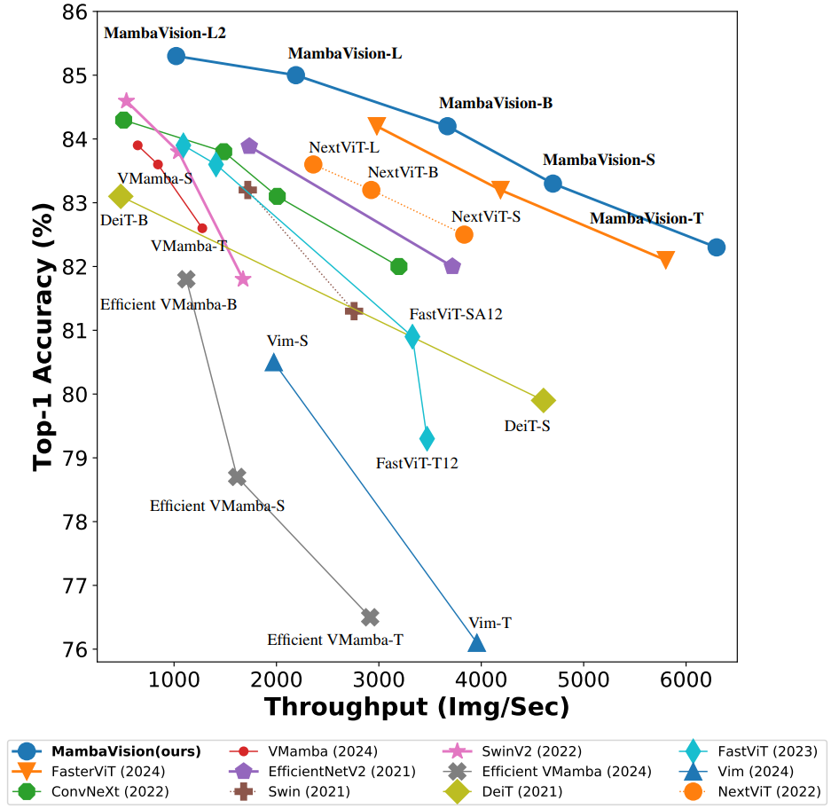
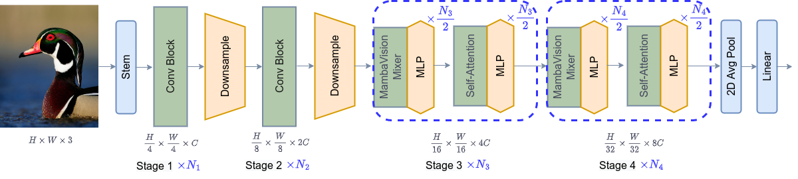

# MambaVision: A Hybrid Mamba-Transformer Vision Backbone

This repository is the PyTorch implementation of **MambaVision: A Hybrid Mamba-Transformer Vision Backbone**. 

We propose a novel hybrid Mamba-Transformer backbone, MambaVision, specifically tailored for vision applications. Our core contribution includes redesigning the Mamba formulation to enhance its capability for efficient modeling of visual features. Through a comprehensive ablation study, we demonstrate the feasibility of integrating Vision Transformers (ViT) with Mamba. Our results show that equipping the Mamba architecture with self-attention blocks in the final layers greatly improves its capacity to capture long-range spatial dependencies. Based on these findings, we introduce a family of MambaVision models with a hierarchical architecture to meet various design criteria. For classification on the ImageNet-1K dataset, MambaVision variants achieve state-of-the-art (SOTA) performance in terms of both Top-1 accuracy and throughput. In downstream tasks such as object detection, instance segmentation, and semantic segmentation on MS COCO and ADE20K datasets, MambaVision outperforms comparably sized backbones while demonstrating favorable performance.




The architecture of MambaVision is demonstrated in the following:




## Introduction


**ImageNet-1K Pretrained Models**

<table>
  <tr>
    <th>Name</th>
    <th>Acc@1</th>
    <th>Throughput(Img/Sec)</th>
    <th>#Params(M)</th>
    <th>FLOPs(G)</th>
  </tr>
<tr>
    <td>MambaVision-T</td>
    <td>82.3</td>
    <td>6298</td>
    <td>31.8</td>
    <td>4.4</td>
</tr>
<tr>
    <td>MambaVision-T2</td>
    <td>82.7</td>
    <td>5590</td>
    <td>35.1</td>
    <td>5.1</td>
</tr>
<tr>
    <td>MambaVision-S</td>
    <td>83.2</td>
    <td>4700</td>
    <td>50.1</td>
    <td>7.5</td>
</tr>

<tr>
    <td>MambaVision-B</td>
    <td>84.2</td>
    <td>3670</td>
    <td>91.8</td>
    <td>13.8</td>
</tr>

<tr>
    <td>MambaVision-L</td>
    <td>85.0</td>
    <td>2190</td>
    <td>206.9</td>
    <td>30.8</td>
</tr>

<tr>
    <td>MambaVision-L2</td>
    <td>85.3</td>
    <td>1021</td>
    <td>227.9</td>
    <td>34.9</td>
</tr>

</table>

## Installation

The dependencies can be installed by running:

```bash
pip install -r requirements.txt
```

## Data Preparation

Please download the ImageNet dataset from its official website. The training and validation images need to have
sub-folders for each class with the following structure:

```bash
  imagenet
  ├── train
  │   ├── class1
  │   │   ├── img1.jpeg
  │   │   ├── img2.jpeg
  │   │   └── ...
  │   ├── class2
  │   │   ├── img3.jpeg
  │   │   └── ...
  │   └── ...
  └── val
      ├── class1
      │   ├── img4.jpeg
      │   ├── img5.jpeg
      │   └── ...
      ├── class2
      │   ├── img6.jpeg
      │   └── ...
      └── ...
 
  ```

## Commands

### Training on ImageNet-1K From Scratch (Multi-GPU)

The `MambaVision` model can be trained from scratch on ImageNet-1K dataset by running:

```bash
python -m torch.distributed.launch --nproc_per_node <num-of-gpus> --master_port 11223  train.py \ 
--config <config-file> --data_dir <imagenet-path> --batch-size <batch-size-per-gpu> --tag <run-tag> --model-ema
```

To resume training from a pre-trained checkpoint:

```bash
python -m torch.distributed.launch --nproc_per_node <num-of-gpus> --master_port 12223  train.py \ 
--resume <checkpoint-path> --config <config-file> --data_dir <imagenet-path> --batch-size <batch-size-per-gpu> --tag <run-tag> --model-ema
```

### Evaluation

To evaluate a pre-trained checkpoint using ImageNet-1K validation set on a single GPU:

```bash
python validate.py --model <model-name> --checkpoint <checkpoint-path> --data_dir <imagenet-path> --batch-size <batch-size-per-gpu>
```
